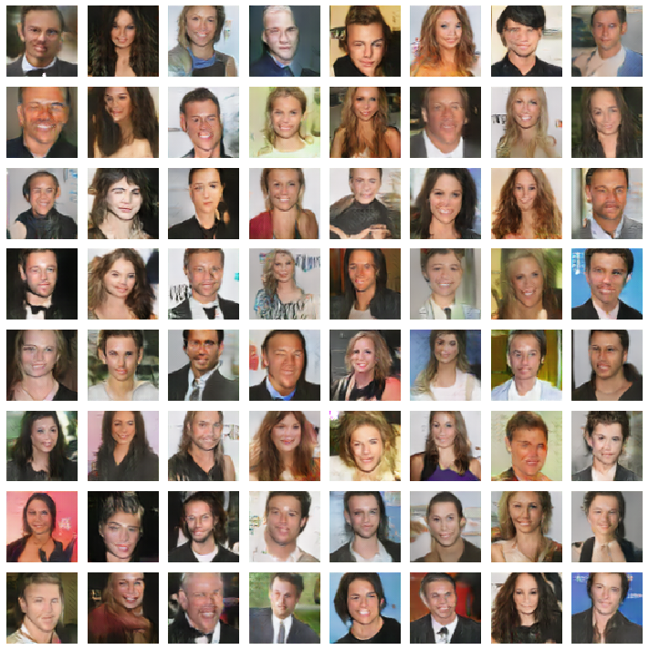

# Celebrity GAN

__Data__: CelebA dataset[[1]](http://mmlab.ie.cuhk.edu.hk/projects/CelebA.html) (202 599 images of celebrities)

__Task__: generate plausible fake images (64x64) of people with a GAN (Generative Adversarial Network)

__Evaluation__: subjective

__Solution__: RaLSGAN[[2]](https://arxiv.org/abs/1807.00734) (Relativistic Average Least Squares GAN)

__Success__: Decent. The network had significant problems with smiling (teeth) and clothing (particularly women's). The training images were quite heterogenous which is a problem a simple center crop can't resolve. Results could be improved by cropping just the faces with a detector[3](https://github.com/ipazc/mtcnn) or metadata available in dataset. RaGANs are able to generate higher resolutions images (up to 256x256) but this would increase training time significantly. Also the training process wasn't optimized (learning rate, epochs).

